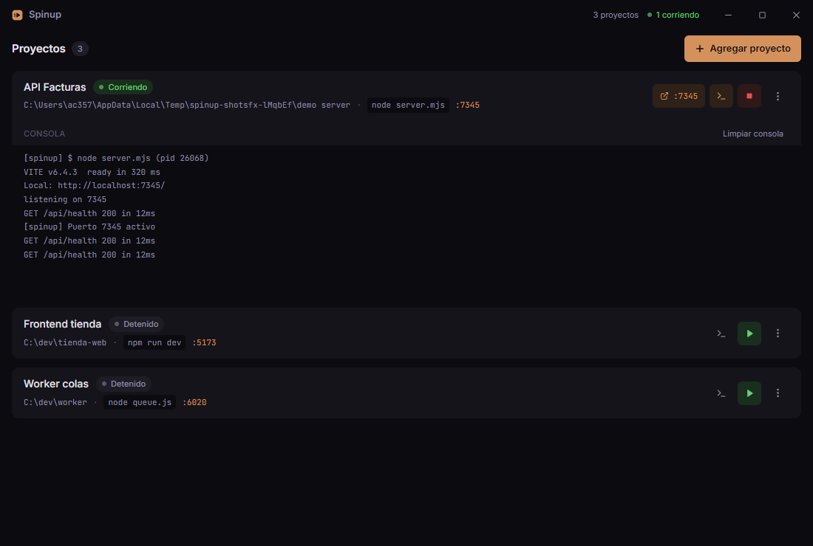

# Spinup

App de escritorio para Windows que registra tus proyectos de desarrollo y los arranca o detiene con un click, sin abrir terminales manualmente. Cada proyecto muestra su estado (detenido / corriendo / error), su salida en una consola integrada en tiempo real, y se detiene matando el árbol de procesos completo.



## Stack

- **Electron 33** — main process con `child_process.spawn` y `taskkill /T /F`
- **React 19 + Vite 6** — renderer
- **Tailwind CSS 4** — tokens planos definidos en `src/renderer/index.css` (`@theme`)
- **electron-store** — persistencia en `%APPDATA%/spinup/config.json`
- **TypeScript** estricto en main, preload y renderer
- **electron-builder** — instalador NSIS para Windows
- **playwright-core** — pruebas E2E contra la app real

## Desarrollo

```bash
npm install
npm run dev        # Vite + Electron con hot reload del renderer
```

## Scripts

| Script | Qué hace |
|---|---|
| `npm run dev` | Arranca Vite (puerto 5183) y Electron apuntando al dev server |
| `npm run build` | Compila main (tsc) y renderer (vite) a `dist/` |
| `npm start` | Build + app en modo producción |
| `npm run typecheck` | Verificación de tipos de los tres procesos |
| `npm run test:e2e` | Build + suite E2E completa (29 verificaciones) |
| `npm run icon` | Regenera `build/icon.ico` y `build/icon.png` |
| `npm run pack` | Empaqueta sin instalador en `release/win-unpacked/` |
| `npm run dist` | Genera el instalador NSIS en `release/` |

## Estructura

```
src/
  main/
    index.ts            # Entry point, ventana frameless, handlers IPC
    process-manager.ts   # spawn/kill/status + deteccion de puerto
    store.ts            # electron-store: CRUD de proyectos
  preload.ts            # contextBridge: window.api
  shared/types.ts       # Tipos compartidos (ProjectConfig, ElectronAPI)
  renderer/
    App.tsx
    components/
      ProjectCard.tsx    # Tarjeta con estado, acciones y menu contextual
      AddProjectModal.tsx# Alta/edicion con selector de carpeta nativo
      ConsoleViewer.tsx  # stdout/stderr en vivo con autoscroll
      TitleBar.tsx       # Controles de ventana custom
tests/
  e2e.mjs               # E2E: crear→iniciar→detener→editar→persistir→eliminar
  screenshots.mjs       # Capturas de pantalla para revision visual
```

## Decisiones clave

- **Toda la lógica de procesos vive en el main process.** El renderer solo habla por `window.api` (contextBridge); no tiene acceso a Node.
- **Detener = `taskkill /pid <pid> /T /F`.** En Windows `process.kill()` no mata a los hijos del shell; taskkill elimina el árbol completo (verificado en el E2E comprobando que el puerto deja de responder).
- **`spawn(command, { shell: true })`** para que funcionen comandos como `npm run dev`.
- **Detección de puerto:** el main sondea `net.createConnection` cada segundo y avisa en consola cuando el puerto responde. El sondeo cierra con FIN (`socket.end()`) para no provocar `ECONNRESET` en servidores sin handler de error.
- **Reglas de puerto:** dos proyectos no pueden registrar el mismo puerto (validación en modal y en main), y si al iniciar el puerto ya está ocupado por otro proceso, el proyecto no arranca y queda en estado de error con la explicación en consola.
- **El puerto definido es obligatorio:** Spinup detecta el dev server detrás del comando — resuelve scripts de `package.json` para `npm run X` / `pnpm X` / `yarn X` / `bun X` — y añade automáticamente el flag nativo de puerto (vite → `--port N --strictPort`, next → `-p N`, astro/nuxt/ng serve/webpack serve → `--port N`, `php artisan serve` → `--port=N`). Además inyecta las variables de entorno `PORT` y `SERVER_PORT` (Laravel) y sustituye el placeholder `{port}` si lo usas en el comando. Si a pesar de todo el proceso anuncia una URL en otro puerto, Spinup espera 6 s a que el puerto definido responda (cubre servidores auxiliares como el Vite de assets dentro de `composer run dev`) y si no responde lo detiene y lo marca en error — nunca queda corriendo en un puerto distinto al definido. Los sondeos de puerto prueban IPv4 e IPv6 (Vite en Windows suele escuchar solo en `::1`).
- **Exposición en la red por defecto (responsive):** a esos mismos dev servers Spinup les añade el flag de host (vite/astro/nuxt → `--host`, next → `-H 0.0.0.0`, angular/webpack/laravel → `--host 0.0.0.0`) para que escuchen en la red local y publiquen su URL "Network", lista para abrir desde el móvil y probar responsive. Para evitarlo en un proyecto, pon tú mismo el host (`--host localhost`, `-H 127.0.0.1`) y Spinup respeta lo que escribiste.
- **Botón "abrir localhost":** cuando el proyecto corre, la tarjeta muestra `↗ :puerto` para abrir la URL en el navegador; aparece al detectar la URL anunciada en la salida o cuando el puerto definido empieza a responder.
- **Liberar puerto:** el menú de cada proyecto (cuando no está corriendo) ofrece "Liberar puerto :N", que mata el árbol de cualquier proceso ajeno que esté escuchando en ese puerto (netstat + taskkill) e informa en consola qué proceso era y si el puerto quedó libre.
- **Consola opt-in:** nunca se abre sola; se muestra solo al pulsar el botón de consola de cada tarjeta.
- **Selector de comandos estilo select2:** el dropdown tiene buscador interno; se escribe dentro para filtrar los presets de npm, pnpm, yarn, bun y node, o para confirmar un comando propio con Enter.
- **Titlebar integrada con estado global:** misma superficie que la página, con contador en vivo de proyectos registrados y procesos corriendo.
- **Store con inicialización perezosa** para respetar `app.setPath('userData')` (las pruebas aíslan su configuración con `SPINUP_USER_DATA`).
- **Sin auto-start:** la app siempre arranca con todos los proyectos detenidos.

## Pruebas

```bash
npm run test:e2e
```

La suite lanza la app empaquetable real (Playwright + Electron), crea un servidor de prueba, y verifica el ciclo completo: alta con validación, arranque, stdout en vivo, detección de puerto, limpieza de consola, parada con verificación real de que el árbol de procesos murió, edición, estado de error, persistencia tras reinicio y eliminación con confirmación.

**Las pruebas no abren ventanas.** Con `SPINUP_HIDDEN=1` la ventana nunca se muestra ni roba el foco (lo usan `tests/e2e.mjs` y `tests/smoke-packaged.mjs`); con `SPINUP_OFFSCREEN=1` la ventana renderiza fuera de pantalla, sin foco ni taskbar, para poder tomar capturas (`tests/screenshots.mjs`). La app normal no se ve afectada por ninguno de los dos modos.
